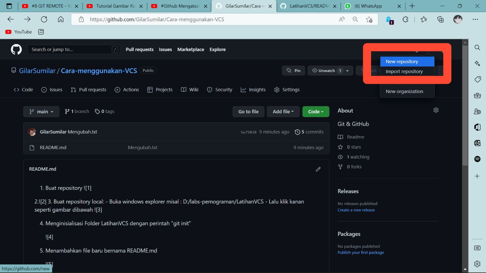
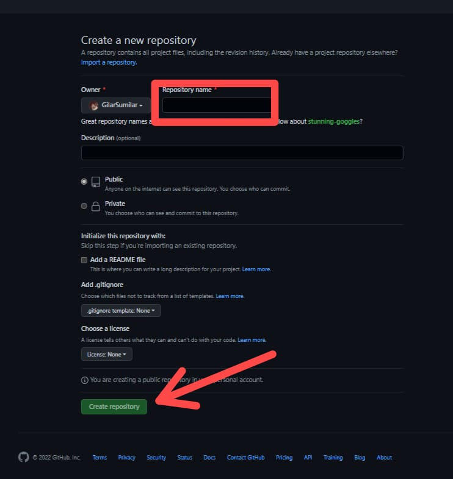
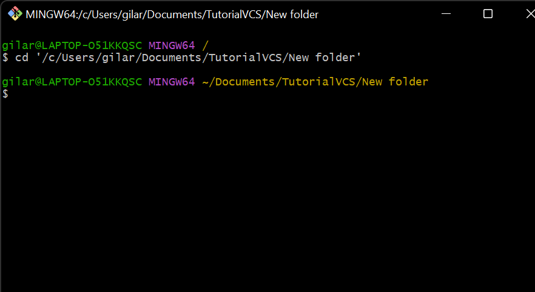
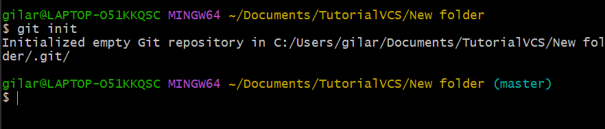
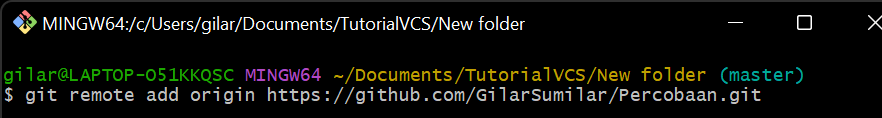

# TutorialVCS

1. Buka GitHub

2. Buat Reposirory

3. Tambahkan Repository name, lalu klik create repository

4. Buat Repository lokal :
   - Buka windows explorer misal
   - Seret file yg akan di jadikan repository
.png)

5. Klik cd (file kalian lalu enter)

6. Menginisialisasi folder new folder dengan perintah "git init"

7. Menghubungkan Git ==> GitHub menggunakan "Git Remote"

